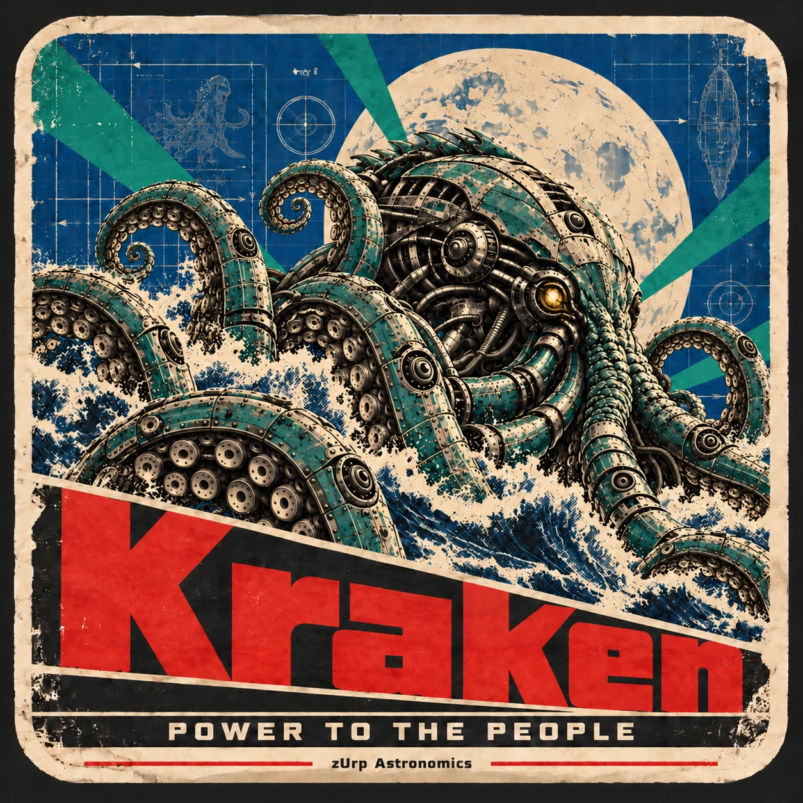
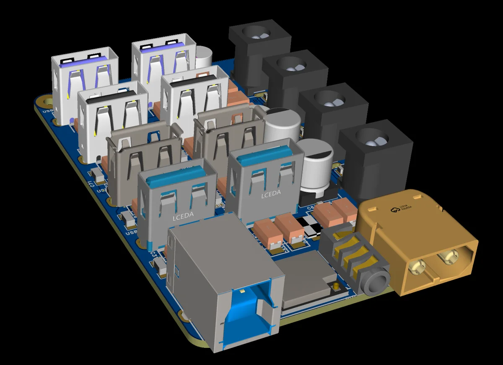

<!-- zurp-readme-header:begin — paste this block once, never again: the poster and the badges update themselves at each build of the site — do not edit it -->

<!-- zurp-readme-header:end -->

<h1 align="center">Kraken</h1>

<strong><em>Power to the people.</em></strong>

  <a href="https://zurp-astronomics.github.io/kraken/">Website</a> ·
  <a href="../../releases">Releases</a> ·
  <a href="https://github.com/zUrp-Astronomics">zUrp Astronomics</a>

---

## 🚧 Work in progress — do not build yet 🚧

**Nothing here is validated on real hardware.** 
Files change without notice, and what you build today may need rework tomorrow. 
👀 Watch the repository to know when the first release lands.

---

## Why Kraken?

Commercial powerboxes sell you a sealed box and an app. Kraken does the job on a board the size of a
Raspberry Pi: up to **250 W through a single XT60**, a **USB 3 type-B host link**, **six USB ports** and
**six power outputs** you can switch or adjust — all in a **130 cm³** case. The Pegasus Pocket
Powerbox Advance Gen2 needs 170. Open hardware, no black box, and the right to fix it yourself.

## At a glance

| | |
|---|---|
| Board | 85 × 56 mm — a Raspberry Pi footprint |
| Case | 90 × 60 × 24 mm, 130 cm³ |
| Power in | XT60, 12 V / 20 A, 250 W max |
| Host link | USB 3 type-B |
| USB ports | 2 × USB 3 (2.5 A) · 3 × USB 2 (2.5 A) · 1 × USB 2 (5 A) |
| DC outputs | 2 × 12 V / 3 A on/off · 2 × controllable, 12 V / 3 A or adjustable 3–10 V / 4 A |
| USB power outputs | 2 × controllable, power only, adjustable 1–5 V / 2 A |
| Brain | ESP32 — an OLED 128 × 64 display is considered |
| Sensors | external temperature and humidity sensor on a jack (connector to be defined) |

## Hardware

The bottom side is fully SMD, made for factory assembly; the top side carries the connectors and the
bulk capacitors. The board's manufacturing files are not in this repository yet.

## Repository layout

| Folder | Contents |
|---|---|
| [`0_Datasheets/`](0_Datasheets/) | datasheets of the components, as published by their makers |
| [`1_Board/`](1_Board/) | the board: today its 3D view; the manufacturing files come with the first validated revision |
| [`9_Assets/`](9_Assets/) | the showcase: product sheet, poster and README images |

## License

- **Hardware design** — boards, mechanics and 3D models: [Open Community License v1.1](LICENSE-HARDWARE).
- **Everything else** — firmware, software, documentation and images: [GNU GPL v3.0](LICENSE).

---

<a href="https://zurp-astronomics.github.io/">zUrp Astronomics</a> — a subsidiary of zUrp Industries. Because buying is cheating.

